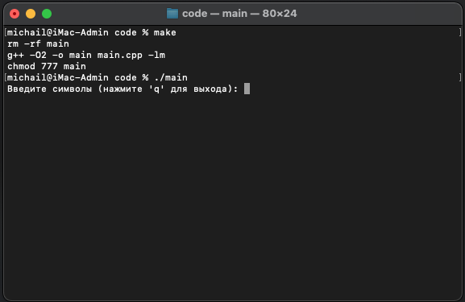
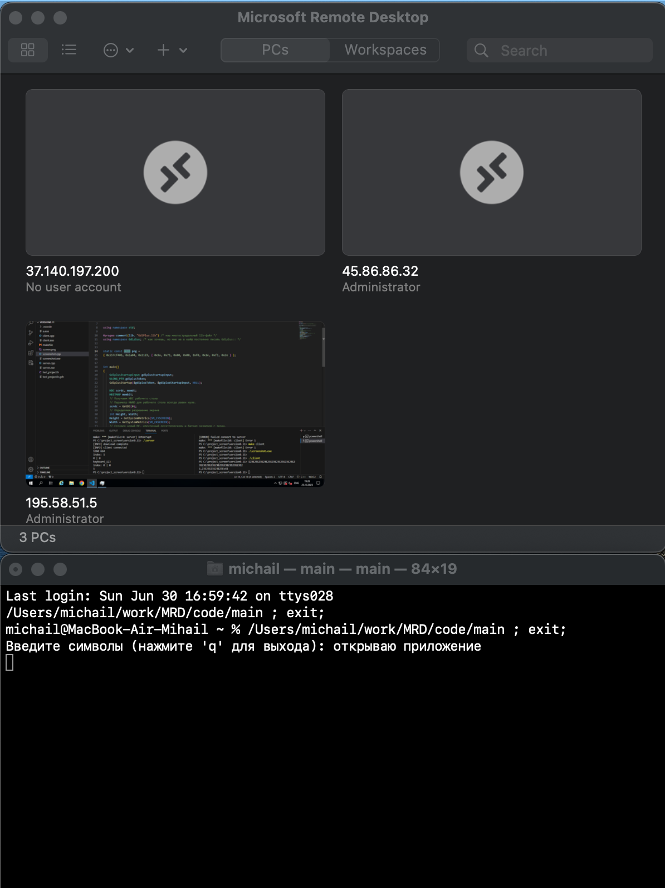
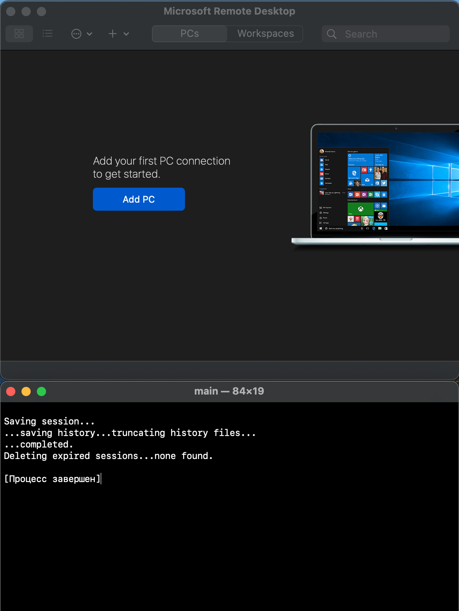

# Automation_MRD

>## Описание проекта
>Данный проект позволяет запускать Microsoft Remote Desktop (при нажатии на клавишу "A" проект открывается) и закрыть проект ("Q" закрыть проект) отчищая все логи и локальные базы данных с которыми взаимодействовало приложение, тем самым отчищая историю использования.

>## Запуск программы
>Для компиляции проекта необходимо прописать ```make``` и ```./main``` для запуска.
>


>## Работа программы
>
>


>## Стек
> 1. С++
> 2. Makefile

>### Автор
>[Михаил Пономарёв](https://github.com/bizarrol423)